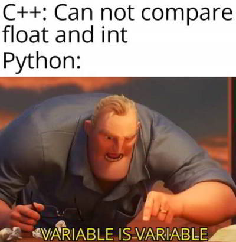

<center>
<h1>
In The Name Of ALLAH
</h1>
<h2>
Advanced Programming - Final Exam
</h2>
<h2>
Dr.Amir Jahanshahi
</h2>
<h3>
Wednesday, 9 Tir - 07:00
</center>


# Introduction
Today you can show us how an amazing programmer you are! Just relax and start coding. Note that you must not change any type in function and class prototypes, but you can add some keywords wherever necessary!

# Grade
We would like to keep track of students in future semesters. So we need a class for them in ```C++```. Before that, we want a separate class to store grades there. So first of all, implement the ```Grade``` class. This class looks like the following.

```c++
class Grade
{
    protected:
       std::vector<std::pair<size_t, double>> grades;
    public:
        Grade(std::vector<std::pair<size_t, double>> grades);
        Grade() = default;
        double average();  
};
```
Grades are stored as a ```vector``` of ```pair```s. Each pair has two elements. The first element is the number of units it has, and the second element is the grade. Note that the ```average()``` is a weighted average of grades stored in this class. You **must** use lambda function in ```average()```.

**Note**: You must **not** use any loop in order to find the average! 

# Student

Now, let's move on to the ```Student``` class. This class has the following member functions and variables.

```c++
class Student : public Grade
{
    private:
    public:
        long id;
        Student(long id, std::vector<std::pair<size_t, double>> grades);
        Student(long sid, Grade grades);
        double average();
        long getID();
};
```

Note that in this class, the ```average()``` just calculates the average of grades without any weighting! In other words, it doesn't consider units (weights) of grades in finding average!

# apfinal

If you've reached here, congratulations! Implement the ```getStudents()``` to read the ```s1.txt``` file and return a vector of students.

You should also implement ```convert()``` so that we can convert containers of ```Student``` to another types of containers of ```Student```. In order to see how this works, you can take a look at gtests!

Finally, implement the ```Compare``` class to pass the final gtest. Note that this class must compare **weighted** average between students using the ```average()``` you implemented in the ```Grade``` class.

Good luck!


